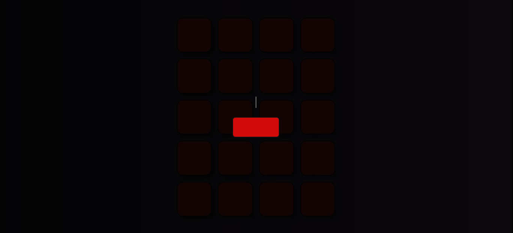
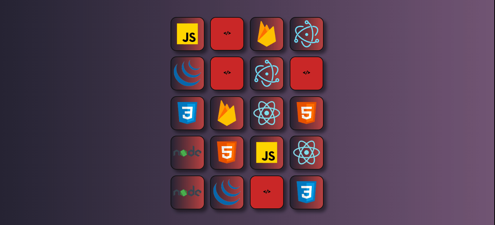

<h1 align="center">Jogo da Memória</h1>

<h1 align="center">
    
</h1>

<h1 align="center">
    
</h1>

<h1 align="center">Sobre</h1>

Aplicação que simula um jogo da memória
  
<h1 align="center">O que aprendi 👨‍💻</h1>
<ul>
    <li>Entendi melhor o funcionamento de métodos em JS</li>
    <li>Aprimoramento de técnicas de estilização no CSS</li>
    <li>Aprendizado de novos métodos de organização da estrutura HTML</li>
</ul>  

Made with 💜 by João Artur 👋 See my <a href="https://www.linkedin.com/in/magalhesartur/">Linkedin</a>

